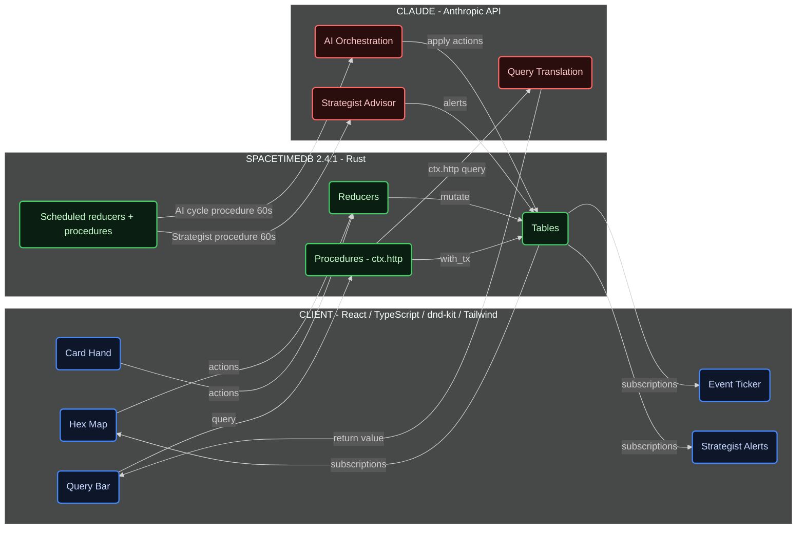

# Risk: Dominion

> **You can occupy a nation with armies, but you cannot truly control it until you dominate its economy, culture, and shadows as well.**

A real-time AI geopolitical strategy game where power is contested across **military, economy,
covert influence, and culture.** 

Military can seize territory.
Economic power can buy influence.
Covert operations can destabilize rivals.
**But culture cannot be imposed.**

<!-- ─────────────────────────────────────────────────────────────
     COVER MEDIA — add before submitting, right here. A ~6s looping
     GIF of the map with quadrant colors flipping live and one
     cultural flip. This is the first thing a judge sees.
     
───────────────────────────────────────────────────────────────── -->

> ### What makes Risk: Dominion different?
>
> - Every territory has **four independent dimensions of control** — and different players can hold each one.
> - **Culture cannot be conquered directly.** It spreads on its own, from economic pressure.
> - **Three Claude-powered AI factions** pursue competing ideologies, each weighting the four dimensions differently.
> - The world evolves in **real time, with no turns.**
> - The entire game runs on a **live SpacetimeDB backend** — the map *is* the database.

---

## One Territory. Four Dimensions of Power.

In the original Risk, "owning" a place means one thing: **whose army stands on it.** One axis.
Tanks.

Risk: Dominion splits control into **four independent dimensions** — and here is the twist the
whole game grows from: *different players can own different dimensions of the same territory at
the same time.*

```
        one territory ("Western Europe")
     ┌───────────┬───────────┐
     │ 🔴 Military│ 🟡 Economic│   most troops │ most capital
     ├───────────┼───────────┤
     │ 🔵 Cultural│ 🟣 Covert  │   most influence │ most agents
     └───────────┴───────────┘
```

| Dimension | You own it when you have… | How you take it |
|-----------|---------------------------|-----------------|
| 🔴 **Military** | the most troops | **Attack** from an adjacent territory |
| 🟡 **Economic** | the most capital | **Invest** in any territory |
| 🟣 **Covert** | the most agents | **Deploy a spy** in any territory |
| 🔵 **Cultural** | the highest influence | *you can't take it directly — see below* |

A single territory can have its army held by you, its economy by a rival, its spies by a third
player, and its culture quietly flipping toward a fourth.

**To "unify" a territory you must own all four of its dimensions at once. Unify five territories
and you win.** That is the whole thesis: you have not conquered a place until you dominate it
militarily, economically, culturally, *and* in the shadows — all of it, all at the same time.

**…and the four dimensions feed each other.** Holding one quietly strengthens the next, in a
loop — so the winning strategy is never a single thing:

```
   🔴 Military ──(invest where you have troops → +capital)──▶ 🟡 Economic
       ▲                                                          │
   (spies add to your attack strength)            (rich regions push culture +15%)
       │                                                          ▼
   🟣 Covert ◀──(own the culture → +10% spy effectiveness)── 🔵 Cultural
```

## You Cannot Conquer Culture

Three dimensions have a card you can play. The fourth — **Cultural** — has none. There is no
"spread culture" button anywhere in the game.

Instead, culture **spreads on its own**, every 30 seconds, out of economic pressure. A territory
with a strong economy radiates cultural gravity into the territories beside it; when foreign
influence in a place builds past a threshold, its culture *flips*. You can never order a region
to become yours. You can only **shape the conditions** — invest in the right border economies —
and let influence do the rest.

It is the rare game rule that models how culture actually works: soft power is not seized, it
seeps. This single design choice is the tell that the people who built this thought about a good
deal more than code.

## A Living World Powered by AI

There are no turns. Nobody waits for anybody. The whole board is alive, breathing on four clocks
running at once:

```
⏱  every  8s   →  every player regains 1 action point  (the currency of every move)
⏱  every 30s   →  culture spreads; territories may flip
⏱  every 60s   →  each AI faction wakes, deliberates, and acts  (staggered starts)
⏱  every 60s   →  your own AI Strategist scans the board and warns you
```

You are the only human at the table. Your three opponents are AI factions reasoning live through
Claude — and each one **values the four dimensions differently**, so each pursues a completely
different ideology:

- **🔴 Zhao — the aggressive general.** Conquers by force. *Military → Covert → Economic → Cultural.*
- **🟡 Consortium — the patient financier.** Buys the board quietly. *Economic → Cultural → Military → Covert.*
- **🟣 Prophet — the enigmatic cultural strategist.** Plays the long, indirect game. *Cultural → Covert → Economic → Military.*

Each faction doesn't just pick moves — it runs a **council of five Claude agents**: four domain
specialists (military, economic, cultural, covert), each seeing only its slice of the board, and
a commander who synthesizes their advice by the faction's priorities. Plant enough spies in a
rival's land and you can **read its actual deliberation** — the council's entire chain of
reasoning, the same words the AI used to decide.

---

## Under the Hood

The premise — a live database *as* the game world — only works because of a handful of deliberate
engineering choices. The ones worth opening up:

### A council of five Claude agents per faction

The obvious way to build an AI opponent is one Claude call per turn. Instead, every faction
reasons like a war room: **four domain specialists plus a commander — five Claude calls per
cycle.**

```
                    Zhao plans one cycle
                            │
   ① snapshot the board — each specialist sees ONLY its own domain
                            │
   ②  four specialists reason in parallel   (Claude · 150 tokens · 15s each)
   ┌─────────────┬─────────────┬─────────────┬─────────────┐
   │ 🔴 Vanguard  │ 🟡 Paymaster │ 🔵 Adjutant  │ 🟣 Scout     │
   │  military    │  economic    │  cultural    │  covert      │
   │ "attack #4"  │ "invest #7"  │    "…"       │ "spy in #4"  │
   └──────┬──────┴──────┬──────┴──────┬──────┴──────┬──────┘
          └─────────────┴──────┬──────┴─────────────┘
                               ▼
   ③  the Commander synthesizes all four   (Claude · 500 tokens · 30s)
        → resolves conflicts by Zhao's aggressive priorities
        → final orders: [attack #4, deploy spy #4]
                               ▼
   ④  apply the orders + log the entire deliberation chain
        (this is exactly what you read when you spy on a faction)
```

The whole cycle follows a strict **transaction → HTTP → transaction** shape: snapshot the board
in one transaction, make the Claude calls with no transaction held open, then commit the actions
in a second. The full chain — every specialist's pitch and the commander's call — is written to
the database, so spying on a rival shows you its real reasoning, not a summary.

### Reducers vs. procedures — a precise split

SpacetimeDB offers two kinds of server function, and the game uses each for exactly what it's for:

```
   Reducer  (every player action)        Procedure  (everything that calls Claude)
   ──────────────────────────────        ──────────────────────────────────────
   ✅ mutates tables, transactionally     ✅ can reach the network via ctx.http
   ❌ no network access                   ✅ can return data to the client
   ❌ returns nothing to the client       ⚠️ not auto-transactional
   e.g. attack · invest · deploy spy      e.g. AI reasoning · natural-language queries
```

The key constraint: **only a procedure can call Claude.** So every AI thought, every
natural-language query, and every Strategist alert *has* to be a procedure — while player moves
stay as plain, deterministic reducers.

### Zero client state — the UI is a mirror of the database

There is no fetching, no polling, and no Redux. The client subscribes to tables and React does
the rest:

```
   a row in the `military` table changes
            │   SpacetimeDB pushes the diff to every subscriber
            ▼
   useTable(tables.military) receives it
            │   React re-renders
            ▼
   that territory's color repaints — in under a second
```

The database is the single source of truth; the interface is just a live reflection of it.

### Details worth noticing

- **All-integer arithmetic.** No floating point anywhere — cultural pressure is `capital / 10`,
  bonuses are integer percentages. The game state is always exact, with no rounding drift.
- **Fire-and-forget events.** Every action writes to the event feed *last*; if that write fails,
  the move still stands. The narrative can never roll back or break gameplay.
- **Replay is a reconstruction, not a recording.** `?replay=true` rebuilds any past moment from
  logged events — proof the database captured everything, down to what each AI was thinking.
- **The API key never leaves the server.** It lives in a private table clients can't subscribe
  to, and never appears in source.

---

<!-- ▼▼▼  EVERYTHING BELOW THIS LINE IS THE ENGINEER'S ORIGINAL README, KEPT VERBATIM  ▼▼▼ -->

## Architecture



---

## Quick Start

```bash
git clone https://github.com/rlin25/RiskDominion.git
cd RiskDominion/risk-dominion
curl -sSf https://install.spacetimedb.com | sh   # SpacetimeDB 2.4.1+ CLI
bash setup.sh
```

The code lives in a single evolving codebase at `risk-dominion/app/` (`app/server` for the Rust module, `app/client` for the React client); each slice is tagged `slice-N-complete` in git. Publish the module, generate the TypeScript bindings, seed the Anthropic key into the private `module_config` table, and run the client:

```bash
spacetime start
spacetime publish --project-path app/server risk-dominion
spacetime generate --lang typescript --out-dir app/client/src/module_bindings --module-path app/server
spacetime call risk-dominion set_config '"anthropic_api_key"' '"sk-ant-..."'
cd app/client && npm install && npm run dev
```

Then open `http://localhost:5173`.

---

## Features

> ### 🔎 Ask the Board Anything
>
> Query the live game state in plain English — *"Where is Zhao weakest?"*, *"Who is closest to
> winning?"*, *"Where should I invest next?"* Claude reads the current database state and answers
> with a one-sentence summary, a sortable data table, and the relevant territories highlighted on
> the map.

- **Four dimensions of control** -- Military, Economic, Cultural, and Covert. Each territory can be owned by a different player in each dimension simultaneously.
- **Split ownership map** -- Victory requires unifying all four dimensions across five territories. Holding land is not enough.
- **Three AI opponents** -- Zhao (aggressive general), Consortium (patient financier), Prophet (cultural spymaster). Each runs a live Claude reasoning cycle every 60 seconds, implemented as a scheduled SpacetimeDB procedure that calls the Anthropic API via `ctx.http` against the same live database the player is reading.
- **Multi-agent AI orchestration** -- Each AI opponent runs a council of five Claude agents: four domain specialists (military, economic, cultural, covert) and a commander who synthesizes their recommendations. All five calls are issued from one reasoning procedure -- fifteen calls per minute across all three AIs.
- **Traceable deliberation chain** -- Every subordinate recommendation and commander decision is logged to the database and queryable through the intel system. See not just what the AI decided, but who recommended what.
- **Passive cultural spread** -- Cultural influence spreads every 30 seconds based on adjacent economic pressure. There is no Cultural card. The dimension is shaped indirectly through economic investment.
- **Cross-dimension bonuses** -- Military protects Economic, Economic funds Cultural, Cultural enables Covert, Covert sharpens Military. Coordinated multi-dimension play compounds.
- **Natural language queries** -- Type any question about the game state in plain English. Claude translates it into a structured response: one-sentence summary, sortable data table, and highlighted territories on the live map.
- **Ten canned queries** -- Pre-optimized prompts for the most common strategic questions, from "Who is winning?" to "Where is my covert presence too thin?"
- **Tab autocomplete** -- Context-aware query completions appear as you type. Up to three suggestions from a live game state snapshot.
- **Live event ticker** -- Every game action narrated in a scrolling feed. Color-coded by player. Geometric SVG icons by dimension. Click any event to highlight the referenced territory on the map.
- **Human Strategist advisor** -- An AI ally that analyzes the full game state every 60 seconds and pushes dismissable alerts: threats, opportunities, and weaknesses. On your side.
- **Full keyboard control** -- Select cards with 1, 2, 3. Navigate the map with WASD or arrow keys. Confirm with Enter or Space. Cancel with Escape. Focus the query bar with Q, toggle intel with I, cycle AI targets with C, highlight owned territories with H.
- **Global chat with deception** -- All four players communicate through a shared channel and private DMs. AI opponents lie, threaten, and try to manipulate you into fighting their enemies. There is no mechanical truth label. Belief is always a choice.
- **AI trust system** -- Each AI tracks a trust score (0-100) for every other player. Claims are cross-referenced against the AI's own agent network. A player who lies and gets caught loses credibility for the rest of the game.
- **Strategist chat analysis** -- The Strategist monitors AI messages and flags likely deceptions based on your agent coverage. "Zhao claims the Consortium is building forces in North Africa. Your agents show no evidence of this."
- **Spectator mode** -- Open any live game in read-only mode via `?spectator=true`. A stats overlay shows hidden state: trust scores, dimension dominance percentages, AI cycle status, and cultural pressure hotspots.
- **Replay system** -- After a game ends, open `?replay=true` to scrub through the full game history. See AI deliberation chains, chat messages, trust score changes, and cultural spread at any moment on a scrubbable timeline.

---

## Tech Stack

| Technology | Role |
|------------|------|
| **SpacetimeDB 2.4.1** | Database, server, and subscriptions -- all in one process |
| **Rust** | Server module: reducers, procedures (with `ctx.http`), views, scheduled functions |
| **React 18** | Frontend UI |
| **TypeScript** | Type-safe client code |
| **Vite** | Frontend build tool and dev server |
| **`spacetimedb` (npm)** | SpacetimeDB client SDK and React hooks (`spacetimedb/react`) |
| **dnd-kit** | Drag-and-drop card interaction |
| **Tailwind CSS** | All styling via utility classes |
| **Claude (Anthropic API)** | AI reasoning, multi-agent orchestration, queries, Strategist -- all called from procedures |

---

## Slice Structure

| Slice | What It Adds |
|-------|-------------|
| **Slice 1** | Core gameplay: two human players, Military and Economic dimensions, hex map with X-split quadrant territories, drag-and-drop cards, real-time sync via SpacetimeDB subscriptions, victory at 3 unified territories |
| **Slice 2** | Single player vs AI: Zhao, Consortium, Prophet. Covert dimension. Deploy Agent card. LLM-powered reasoning cycles every 60 seconds. Intel system: earn access to AI plans by deploying agents. |
| **Slice 3** | Cultural dimension with passive spread mechanic. Cross-dimension bonuses. Victory expanded to 5 unified territories across all four dimensions. |
| **Slice 4** | Natural language query bar. Ten canned query buttons. Tab autocomplete. Live event ticker narrating every action. All powered by Claude against live database tables. |
| **Slice 5** | Multi-agent AI orchestration: commander + 4 domain specialists per AI. Human Strategist advisor with proactive alerts. Full keyboard control with discoverable hotkey hints. |
| **Slice 6** | Global chat with deception mechanics. AI opponents lie, threaten, and issue false reassurances. Per-player trust scores updated by cross-referencing claims against agent networks. Strategist flags likely deceptions. |
| **Slice 7** | Spectator mode (read-only live view with stats overlay). Replay system: scrubbable post-game timeline showing AI deliberation, chat history, trust score changes, and cultural pressure at any moment. |

---

## Documentation

- [GLOSSARY.md](risk-dominion/GLOSSARY.md) -- Every game term defined in plain English for judges and new players
- [ARCHITECTURE.md](risk-dominion/ARCHITECTURE.md) -- Technical deep-dive: tables, reducers, AI orchestration, data flow diagrams
- [DEMO_SCRIPT.md](risk-dominion/DEMO_SCRIPT.md) -- Timed 7-minute walkthrough script for presenting to judges
- [AESTHETIC.md](risk-dominion/AESTHETIC.md) -- Visual design system: colors, fonts, territory rendering, component specs
- [SETUP.md](risk-dominion/SETUP.md) -- Environment setup, verification, and troubleshooting

**Design decisions by slice:**
- [slice-1/DECISIONS_SLICE_1.md](risk-dominion/slice-1/DECISIONS_SLICE_1.md) -- Core gameplay design philosophy
- [slice-2/DECISIONS_SLICE_2.md](risk-dominion/slice-2/DECISIONS_SLICE_2.md) -- AI opponents and intel system design
- [slice-3/DECISIONS_SLICE_3.md](risk-dominion/slice-3/DECISIONS_SLICE_3.md) -- Cultural dimension and cross-dimension bonuses
- [slice-4/DECISIONS_SLICE_4.md](risk-dominion/slice-4/DECISIONS_SLICE_4.md) -- Query system and event ticker
- [slice-5/DECISIONS_SLICE_5.md](risk-dominion/slice-5/DECISIONS_SLICE_5.md) -- Multi-agent orchestration, Strategist, and hotkeys
- [slice-6/DECISIONS_SLICE_6.md](risk-dominion/slice-6/DECISIONS_SLICE_6.md) -- Global chat, deception mechanics, and AI trust system
- [slice-7/DECISIONS_SLICE_7.md](risk-dominion/slice-7/DECISIONS_SLICE_7.md) -- Spectator mode and replay system

---

## Team

| Name | Role |
|------|------|
| [Team member] | [Role] |
| [Team member] | [Role] |
