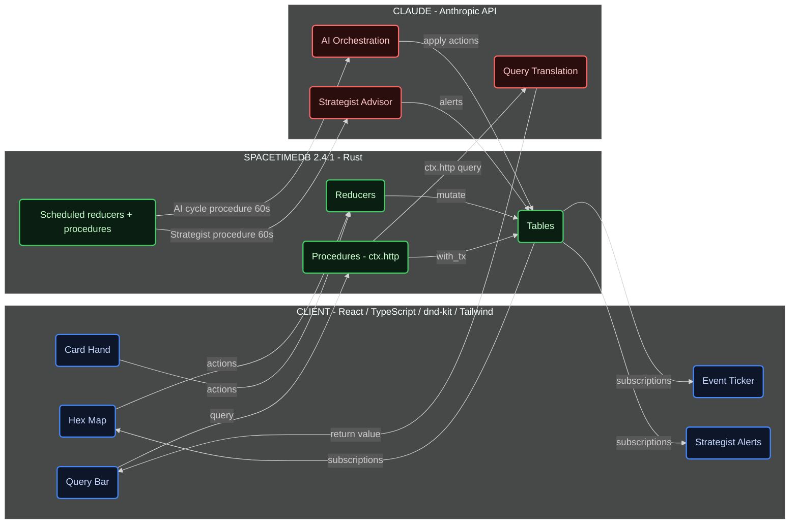

# Risk: Dominion

**A real-time strategy game where the battlefield is a live multidimensional database, powered by SpacetimeDB and Claude.**

---

## Architecture



---

## Quick Start

```bash
git clone https://github.com/rlin25/RiskDominion.git
cd RiskDominion/risk-dominion
curl -sSf https://install.spacetimedb.com | sh   # SpacetimeDB 2.4.1+ CLI
bash setup.sh
```

The code lives in a single evolving codebase at `risk-dominion/app/` (`app/server` for the Rust module, `app/client` for the React client); each slice is tagged `slice-N-complete` in git. Publish the module, generate the TypeScript bindings, seed the Anthropic key into the private `module_config` table, and run the client:

```bash
spacetime start
spacetime publish --project-path app/server risk-dominion
spacetime generate --lang typescript --out-dir app/client/src/module_bindings --module-path app/server
spacetime call risk-dominion set_config '"anthropic_api_key"' '"sk-ant-..."'
cd app/client && npm install && npm run dev
```

Then open `http://localhost:5173`.

---

## Features

- **Four dimensions of control** -- Military, Economic, Cultural, and Covert. Each territory can be owned by a different player in each dimension simultaneously.
- **Split ownership map** -- Victory requires unifying all four dimensions across five territories. Holding land is not enough.
- **Three AI opponents** -- Zhao (aggressive general), Consortium (patient financier), Prophet (cultural spymaster). Each runs a live Claude reasoning cycle every 60 seconds, implemented as a scheduled SpacetimeDB procedure that calls the Anthropic API via `ctx.http` against the same live database the player is reading.
- **Multi-agent AI orchestration** -- Each AI opponent runs a council of five Claude agents: four domain specialists (military, economic, cultural, covert) and a commander who synthesizes their recommendations. All five calls are issued from one reasoning procedure -- fifteen calls per minute across all three AIs.
- **Traceable deliberation chain** -- Every subordinate recommendation and commander decision is logged to the database and queryable through the intel system. See not just what the AI decided, but who recommended what.
- **Passive cultural spread** -- Cultural influence spreads every 30 seconds based on adjacent economic pressure. There is no Cultural card. The dimension is shaped indirectly through economic investment.
- **Cross-dimension bonuses** -- Military protects Economic, Economic funds Cultural, Cultural enables Covert, Covert sharpens Military. Coordinated multi-dimension play compounds.
- **Natural language queries** -- Type any question about the game state in plain English. Claude translates it into a structured response: one-sentence summary, sortable data table, and highlighted territories on the live map.
- **Ten canned queries** -- Pre-optimized prompts for the most common strategic questions, from "Who is winning?" to "Where is my covert presence too thin?"
- **Tab autocomplete** -- Context-aware query completions appear as you type. Up to three suggestions from a live game state snapshot.
- **Live event ticker** -- Every game action narrated in a scrolling feed. Color-coded by player. Geometric SVG icons by dimension. Click any event to highlight the referenced territory on the map.
- **Human Strategist advisor** -- An AI ally that analyzes the full game state every 60 seconds and pushes dismissable alerts: threats, opportunities, and weaknesses. On your side.
- **Full keyboard control** -- Select cards with 1, 2, 3. Navigate the map with WASD or arrow keys. Confirm with Enter or Space. Cancel with Escape. Focus the query bar with Q, toggle intel with I, cycle AI targets with C, highlight owned territories with H.
- **Global chat with deception** -- All four players communicate through a shared channel and private DMs. AI opponents lie, threaten, and try to manipulate you into fighting their enemies. There is no mechanical truth label. Belief is always a choice.
- **AI trust system** -- Each AI tracks a trust score (0-100) for every other player. Claims are cross-referenced against the AI's own agent network. A player who lies and gets caught loses credibility for the rest of the game.
- **Strategist chat analysis** -- The Strategist monitors AI messages and flags likely deceptions based on your agent coverage. "Zhao claims the Consortium is building forces in North Africa. Your agents show no evidence of this."
- **Spectator mode** -- Open any live game in read-only mode via `?spectator=true`. A stats overlay shows hidden state: trust scores, dimension dominance percentages, AI cycle status, and cultural pressure hotspots.
- **Replay system** -- After a game ends, open `?replay=true` to scrub through the full game history. See AI deliberation chains, chat messages, trust score changes, and cultural spread at any moment on a scrubbable timeline.

---

## Tech Stack

| Technology | Role |
|------------|------|
| **SpacetimeDB 2.4.1** | Database, server, and subscriptions -- all in one process |
| **Rust** | Server module: reducers, procedures (with `ctx.http`), views, scheduled functions |
| **React 18** | Frontend UI |
| **TypeScript** | Type-safe client code |
| **Vite** | Frontend build tool and dev server |
| **`spacetimedb` (npm)** | SpacetimeDB client SDK and React hooks (`spacetimedb/react`) |
| **dnd-kit** | Drag-and-drop card interaction |
| **Tailwind CSS** | All styling via utility classes |
| **Claude (Anthropic API)** | AI reasoning, multi-agent orchestration, queries, Strategist -- all called from procedures |

---

## Slice Structure

| Slice | What It Adds |
|-------|-------------|
| **Slice 1** | Core gameplay: two human players, Military and Economic dimensions, hex map with X-split quadrant territories, drag-and-drop cards, real-time sync via SpacetimeDB subscriptions, victory at 3 unified territories |
| **Slice 2** | Single player vs AI: Zhao, Consortium, Prophet. Covert dimension. Deploy Agent card. LLM-powered reasoning cycles every 60 seconds. Intel system: earn access to AI plans by deploying agents. |
| **Slice 3** | Cultural dimension with passive spread mechanic. Cross-dimension bonuses. Victory expanded to 5 unified territories across all four dimensions. |
| **Slice 4** | Natural language query bar. Ten canned query buttons. Tab autocomplete. Live event ticker narrating every action. All powered by Claude against live database tables. |
| **Slice 5** | Multi-agent AI orchestration: commander + 4 domain specialists per AI. Human Strategist advisor with proactive alerts. Full keyboard control with discoverable hotkey hints. |
| **Slice 6** | Global chat with deception mechanics. AI opponents lie, threaten, and issue false reassurances. Per-player trust scores updated by cross-referencing claims against agent networks. Strategist flags likely deceptions. |
| **Slice 7** | Spectator mode (read-only live view with stats overlay). Replay system: scrubbable post-game timeline showing AI deliberation, chat history, trust score changes, and cultural pressure at any moment. |

---

## Documentation

- [GLOSSARY.md](risk-dominion/GLOSSARY.md) -- Every game term defined in plain English for judges and new players
- [ARCHITECTURE.md](risk-dominion/ARCHITECTURE.md) -- Technical deep-dive: tables, reducers, AI orchestration, data flow diagrams
- [DEMO_SCRIPT.md](risk-dominion/DEMO_SCRIPT.md) -- Timed 7-minute walkthrough script for presenting to judges
- [AESTHETIC.md](risk-dominion/AESTHETIC.md) -- Visual design system: colors, fonts, territory rendering, component specs
- [SETUP.md](risk-dominion/SETUP.md) -- Environment setup, verification, and troubleshooting

**Design decisions by slice:**
- [slice-1/DECISIONS_SLICE_1.md](risk-dominion/slice-1/DECISIONS_SLICE_1.md) -- Core gameplay design philosophy
- [slice-2/DECISIONS_SLICE_2.md](risk-dominion/slice-2/DECISIONS_SLICE_2.md) -- AI opponents and intel system design
- [slice-3/DECISIONS_SLICE_3.md](risk-dominion/slice-3/DECISIONS_SLICE_3.md) -- Cultural dimension and cross-dimension bonuses
- [slice-4/DECISIONS_SLICE_4.md](risk-dominion/slice-4/DECISIONS_SLICE_4.md) -- Query system and event ticker
- [slice-5/DECISIONS_SLICE_5.md](risk-dominion/slice-5/DECISIONS_SLICE_5.md) -- Multi-agent orchestration, Strategist, and hotkeys
- [slice-6/DECISIONS_SLICE_6.md](risk-dominion/slice-6/DECISIONS_SLICE_6.md) -- Global chat, deception mechanics, and AI trust system
- [slice-7/DECISIONS_SLICE_7.md](risk-dominion/slice-7/DECISIONS_SLICE_7.md) -- Spectator mode and replay system

---

## Team

| Name | Role |
|------|------|
| [Team member] | [Role] |
| [Team member] | [Role] |
