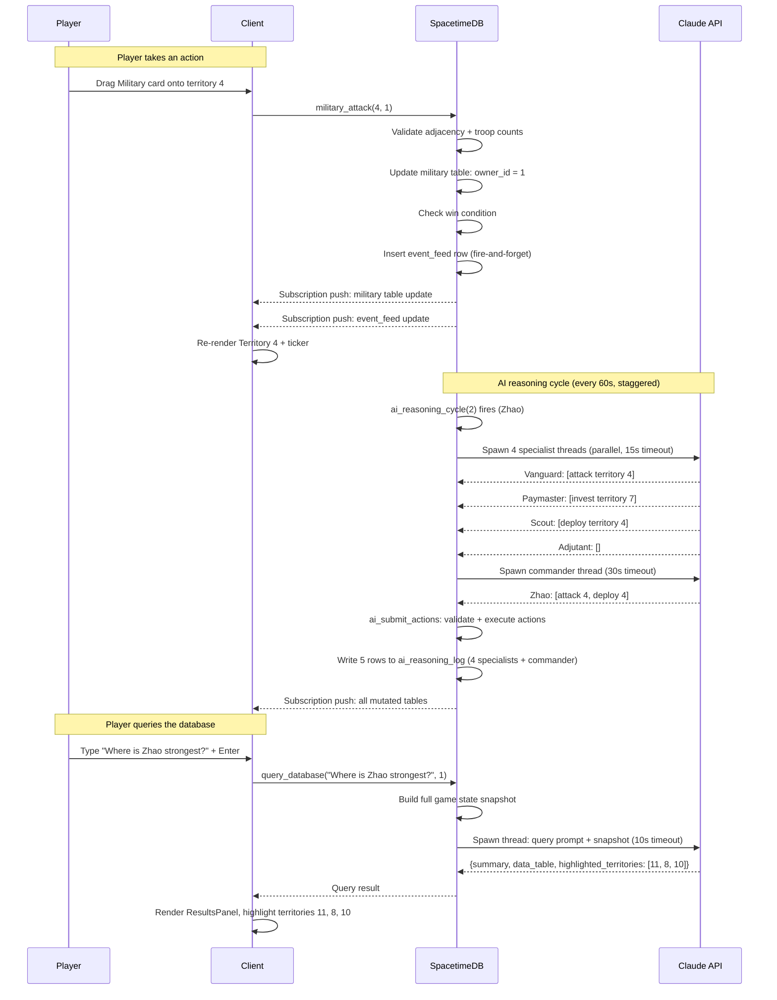

# ARCHITECTURE -- Risk: Dominion

A technical deep-dive for judges and engineers who want to understand how the system works.

For game terms and concepts, see [GLOSSARY.md](GLOSSARY.md).

---

## Overview

Risk: Dominion is a single-page React application connected to a SpacetimeDB server written in Rust. All game state lives in SpacetimeDB tables. The client subscribes to those tables and re-renders in real time whenever data changes. Three AI opponents reason through a multi-agent orchestration pipeline powered by Claude. A natural language query system translates player questions into live database queries. The backend has no separate web server, REST layer, or message broker -- SpacetimeDB handles tables, reducers, subscriptions, and scheduled functions in a single process.

---

## SpacetimeDB Layer

### Tables

There are twelve tables. Four dimension tables hold the core game state. The rest support players, AI, events, queries, and communication.

| Table | Primary Key | Key Columns | Purpose |
|-------|-------------|-------------|---------|
| `military` | `territory_id` | `owner_id`, `troop_count` | Military dimension ownership per territory |
| `economic` | `territory_id` | `owner_id`, `capital` | Economic dimension ownership and capital |
| `cultural` | `territory_id` | `owner_id`, `influence_pct` | Cultural dimension ownership and accumulating influence |
| `covert` | `territory_id` | `owner_id`, `agent_count` | Covert dimension ownership and agent count |
| `players` | `player_id` | `player_name`, `color`, `action_points`, `is_ai` | All players -- human and AI share the same table |
| `game_state` | `key` | `value`, `started_at`, `ended_at` | Global flags: `status` (active/ended), `winner`; `ended_at` set on victory (used for replay timeline bounds) |
| `event_feed` | `id` (auto) | `event_text`, `player_id`, `territory_id`, `event_type`, `timestamp` | Narrative events for the ticker |
| `ai_state` | `ai_player_id` | `cycle_status`, `last_cycle_at` | Whether each AI is idle or mid-cycle |
| `ai_reasoning_log` | `id` (auto) | `ai_player_id`, `cycle_at`, `subordinate_id`, `reasoning_text`, `actions_taken` | Full deliberation chain per AI cycle |
| `strategist_log` | `id` (auto) | `notification`, `priority`, `territory_id`, `dismissed` | Player-facing Strategist alert notifications |
| `chat_log` | `id` (auto) | `sender_id`, `recipient_id`, `message_text`, `is_truthful`, `timestamp` | All chat messages; `recipient_id` null = public, set = DM; `is_truthful` server-side only |
| `ai_trust` | `(ai_player_id, target_player_id)` | `trust_score` | Per-AI trust score (0-100) for every other player; updated after claim verification |

The four dimension tables are the game. Each row in `military` represents one territory's military state. The same territory has one row in each of the four dimension tables. A territory is "unified" for a player when all four rows point to the same `owner_id`.

The `players` table does not distinguish AI from human by schema position -- only by the `is_ai` boolean. AI opponents call the same reducers, pay the same action point costs, and are subject to the same validation rules as the human player.

### Reducers

Reducers are the only way to mutate tables. There are three categories:

**Client-callable (player actions):**
- `start_game()` -- seeds all 12 territories across all four dimensions, inserts players, initializes AI state
- `military_attack(territory_id, player_id)` -- validates adjacency, compares troops, transfers Military ownership if attacker wins
- `economic_invest(territory_id, player_id)` -- adds capital, transfers Economic ownership if player's capital exceeds owner's; applies Military bonus if player owns Military in that territory
- `deploy_agent(territory_id, player_id)` -- adds one agent, transfers Covert ownership if player's count exceeds owner's

**Client-callable (chat):**
- `send_chat_message(message, recipient_id, player_id)` -- writes to `chat_log`; `recipient_id` null = public, set = private DM visible only to sender and recipient

**Client-callable (queries and intel):**
- `query_database(question, player_id)` -- builds game state snapshot, calls Claude, returns `{summary, data_table, highlighted_territories}`
- `get_canned_query(query_id, player_id)` -- same pipeline with pre-formulated prompt for one of 10 fixed questions
- `autocomplete_query(partial, player_id)` -- returns up to 3 context-aware query suggestions
- `get_intel(ai_player_id)` -- checks agent threshold, returns deliberation chain or "insufficient" message
- `dismiss_strategist_alert(notification_id)` -- sets `dismissed = true` on a Strategist log entry

**Internal only:**
- `ai_submit_actions(ai_player_id, actions, reasoning, cycle_at, subordinate_results)` -- validates and executes AI action batch, writes full deliberation chain to `ai_reasoning_log`
- `dimension_owner_change(territory_id, dimension, new_owner)` -- internal function called after any ownership flip to check the win condition

**Scheduled:**
- `regenerate_action_points()` -- fires every 8 seconds; adds 1 point to every player with points below 10
- `cultural_spread_tick()` -- fires every 30 seconds; calculates cultural pressure from all adjacent territories and accumulates influence; triggers flips when influence exceeds 50
- `ai_reasoning_cycle(ai_player_id)` -- fires every 60 seconds per AI (three instances, staggered 20s apart); runs the full orchestration pipeline
- `strategist_cycle()` -- fires every 60 seconds, initial offset 50 seconds; runs the Strategist advisor pipeline

### Subscriptions

The client opens one subscription per table and receives full row sets on connect, then differential updates as rows change. There is no query language or filtering at the subscription layer -- the client subscribes to entire tables and maintains a local mirror.

When a reducer mutates a table row, SpacetimeDB automatically delivers the changed row to every subscriber. The client's `useSubscriptions` hook merges updates into React state. Components that depend on that state re-render. The round trip from reducer call to map color change is under one second on a local network.

---

## AI Orchestration

### Single-Agent Architecture (Slices 2 through 4)

In Slices 2 through 4, each AI opponent's reasoning cycle makes one Claude API call. The scheduled reducer fires, builds a game state snapshot (all dimension tables, player states, adjacency map), constructs a prompt with the AI's persona description, and spawns a thread to call the Anthropic API. The thread uses `reqwest::blocking::Client` with a 30-second timeout. On success, the thread parses the JSON action array and calls `ai_submit_actions`. On timeout or error, `cycle_status` is reset to `idle` and a timeout event is written to the event feed.

### Multi-Agent Architecture (Slice 5)

In Slice 5, each reasoning cycle runs five Claude calls in a defined hierarchy.

**Step 1 -- Domain snapshots.** The reducer builds four narrowly-scoped game state snapshots, each containing only the data relevant to one domain:
- Military snapshot: military table, covert table (for combat bonus), adjacency map, players
- Economic snapshot: economic table, military table (for invest bonus), adjacency map, players
- Cultural snapshot: cultural table, economic table (for pressure calculation), adjacency map, players
- Covert snapshot: covert table, cultural table (for intel bonus), players

**Step 2 -- Specialist calls (parallel).** Four threads are spawned simultaneously, one per specialist. Each thread calls Claude with its domain snapshot and a specialist prompt that includes the AI's persona context, the expected JSON output format, and a narrow task (e.g., "recommend up to 3 attack targets"). Each specialist call uses temperature 0.3, max tokens 150, and a 15-second timeout. On timeout or error, the specialist returns an empty recommendation array. Specialist identities:

| AI | Military | Economic | Cultural | Covert |
|----|----------|----------|----------|--------|
| Zhao | Vanguard | Paymaster | Adjutant | Scout |
| Consortium | Actuary | Auditor | Appraiser | Courier |
| Prophet | Warden | Seer | Whisper | Oracle |

**Step 3 -- Join.** The reducer calls `join()` on all four thread handles and collects their results. Timed-out specialists contribute empty arrays and a "specialist unavailable" note to the commander prompt.

**Step 4 -- Commander call.** A fifth thread is spawned with a commander prompt that includes: the full game state, the AI's persona priorities, and all four specialist recommendation arrays (or timeout notices). The commander synthesizes the inputs, resolves conflicts according to persona priorities, and returns the final action batch. Temperature 0.3, max tokens 500, timeout 30 seconds.

**Step 5 -- Submission.** On commander success, `ai_submit_actions` is called with the action array plus all subordinate results. The function writes one `ai_reasoning_log` row per subordinate (specialists first, commander last), all sharing the same `cycle_at` timestamp. On commander timeout, `cycle_status` resets to `idle` and a timeout event is written.

### Intel Query

When the player calls `get_intel(ai_player_id)`, the reducer:
1. Checks the player's maximum agent count across all territories where the AI has Military or Economic presence.
2. Applies the Cultural bonus (+10% to effective agent count if the player owns Cultural in the queried territory).
3. If effective agent count is less than 3: returns `insufficient_intel`.
4. If 3 or more: queries `ai_reasoning_log` for the most recent `cycle_at` for this AI, returns all rows for that cycle ordered by subordinate (specialists first, commander last) as a `deliberation` array.

---

## Query System

### Natural Language Pipeline

```
Player types question
        |
        v
Client calls query_database(question, player_id)
        |
        v
Server builds full game state snapshot
(all four dimension tables, players, unified territory counts)
        |
        v
Server constructs prompt with:
  - Game state snapshot as structured text
  - JSON output format instructions
  - Player's question
        |
        v
Thread spawns, calls Claude API (10s timeout)
        |
        v
Claude returns JSON: { summary, data_table, highlighted_territories }
        |
        v
Server writes result to a response table or returns via reducer callback
        |
        v
Client receives update via subscription
        |
        v
ResultsPanel renders: summary text + sortable data table
Map highlights the returned territory IDs with gold glow
```

The game state snapshot includes every row of every dimension table, formatted as structured text. Claude receives the actual live values -- not cached summaries. The response JSON must contain three fields: a `summary` string (one sentence), a `data_table` object with `columns` and `rows`, and a `highlighted_territories` array of territory IDs.

On any error -- timeout, unparseable JSON, API failure -- the reducer returns a graceful error response: `{summary: "Could not process that question. Try a different phrasing or use a canned query button.", data_table: {columns: [], rows: []}, highlighted_territories: []}`. The game never crashes on a failed query.

### Canned Queries

Ten pre-formulated prompts are stored as constants in `lib.rs`. Each is a carefully worded question optimized for consistent, structured Claude responses. When the player clicks a canned query button, the same pipeline runs but with the pre-formulated prompt instead of the player's input. Canned queries produce more consistent results because their format instructions have been tuned for the specific data shape each question requires.

### Tab Autocomplete

When the player presses Tab in the query bar, `autocomplete_query(partial, player_id)` is called with the current partial text. A thread calls Claude with the partial text, a brief game state summary, and instructions to suggest up to 3 context-appropriate completions. The 5-second timeout ensures the dropdown feels responsive. Suggestions are displayed in a dropdown below the query bar. Pressing Tab again cycles through suggestions. Pressing Escape closes the dropdown.

---

## Client Architecture

### Component Tree

```
App
 +-- ActionBar (action points display)
 +-- QueryBar (text input, canned query pills, autocomplete dropdown)
 +-- ResultsPanel (summary, sortable data table, close button)
 +-- Map
 |    +-- Territory x12 (hex SVG, X-split quadrant fill, labels)
 +-- CardHand
 |    +-- ActionCard x N (drag source, hotkey hint)
 +-- IntelPanel (AI deliberation chain, hotkey hint)
 +-- ChatPanel (global channel tab, DM tabs for each AI, message input)
 +-- EventTicker (scrolling feed, click-to-highlight)
 +-- StrategistAlerts (stacked notification cards including chat analysis)
 +-- VictoryScreen (overlay, conditionally rendered)
```

### Spectator and Replay Modes

The client uses URL parameter routing to switch between three modes:

**Default (player mode):** Full interactive game. All reducers callable. Cards draggable.

**Spectator mode (`?spectator=true`):** Read-only. No reducer calls. Cards not draggable. A stats overlay renders over the map showing: unified territory counts per faction, dimension dominance percentages, trust scores between every pair of players, which AI cycle is currently active, and territories with the highest cultural pressure. Multiple spectators connect simultaneously -- each receives the same live subscription updates.

**Replay mode (`?replay=true`):** Activated after a game ends. A timeline bar spans from `game_state.started_at` to `game_state.ended_at`. Colored markers represent every event in `event_feed`. The playhead can be dragged to any point; the client reconstructs map state from the initial seed plus all logged actions up to that timestamp. At any timeline position, the intel panel shows the most recent `ai_reasoning_log` cycle before that timestamp. The chat panel shows all `chat_log` messages up to that timestamp. Trust score history is derived from `ai_trust` update events. Speed controls (1x, 2x, 4x) replay events in real time.

### State Management

There is no global state library. State lives in two places:

**Subscription state** -- the `useSubscriptions` hook subscribes to all SpacetimeDB tables and stores their contents as React state. Every table update from SpacetimeDB flows through this hook and causes dependent components to re-render.

**UI state** -- local `useState` in `App.tsx` manages ephemeral view state: the selected territory for keyboard navigation, the focused card type, the open/closed state of panels, query results, ticker highlights, and the owned-territories highlight toggle.

### Hotkey System

A `keydown` event listener is attached to `document` in a `useEffect` in `App.tsx`. The handler checks `document.activeElement` before processing: if an `INPUT` element has focus (the query bar), only Tab, Escape, and Enter are processed. All other keys type into the input normally.

When hotkeys are active, the full map is navigable from the keyboard. WASD and arrow keys move the selection cursor by computing the nearest territory in the pressed direction using a `HEX_GRID_COORDINATES` map (territory ID to x/y grid position). Euclidean distance determines "nearest." The cursor selects the next territory without requiring adjacency -- adjacency is enforced only when Enter confirms a Military Attack.

---

## Data Flow Diagram



---

## Key Design Decisions

**Real-time over turn-based.** Turns would require a clock, a phase system, and coordination logic. Real-time allows every mechanic to be a simple timer or event check. The action point regeneration is a scheduled reducer. Cultural spread is a scheduled reducer. AI reasoning is a scheduled reducer. The game has no game loop -- it has a database and a set of scheduled functions.

**Split ownership over single owner.** A single "owner" field per territory would make the game simpler but would eliminate the core tension. By tracking four independent ownership dimensions per territory, the map becomes a live multidimensional query result rather than a colored land map. This is the premise of the project.

**Passive cultural spread over an active Cultural card.** Giving the player a Cultural card would make it a fourth direct action competing with the other three. Making culture passive creates a system that requires players to think indirectly, investing economically in border territories to shape an outcome they cannot directly control. It also demonstrates scheduled reducer mechanics without adding UI complexity.

**Orchestration over single-agent AI.** A single Claude call per AI cycle produces one perspective. Orchestration with four specialists produces domain-focused analysis from narrow contexts, then synthesizes them through a commander with persona priorities. The result is more strategically coherent AI behavior -- and a deliberation chain the player can read through the intel system.

**Fire-and-forget events.** Every reducer writes to the event feed as its last operation, wrapped in an error handler. If the write fails, the reducer's primary mutation has already committed. The narrative cannot block or roll back gameplay. This keeps the event feed as a faithfully accurate side-channel without making it a reliability dependency.

**All integer arithmetic.** The server uses no floating-point numbers. Cultural pressure is `capital / 10` (integer division). Bonuses are `agents + (agents * 10 / 100)`. Truncation toward zero is consistent and predictable. No rounding errors. No floating-point edge cases. The game state is always an exact integer value.
