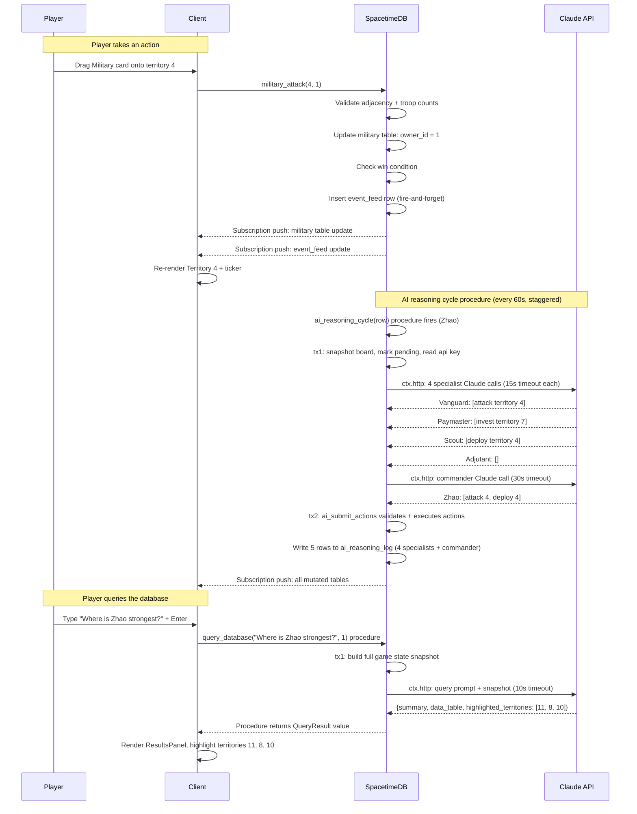

# ARCHITECTURE -- Risk: Dominion

A technical deep-dive for judges and engineers who want to understand how the system works.

For game terms and concepts, see [GLOSSARY.md](GLOSSARY.md).

---

## Overview

Risk: Dominion is a single-page React application connected to a SpacetimeDB server (version 2.4.1) written in Rust. All game state lives in SpacetimeDB tables. The client subscribes to those tables and re-renders in real time whenever data changes. Three AI opponents reason through a multi-agent orchestration pipeline powered by Claude. A natural language query system translates player questions into live database queries. The backend has no separate web server, REST layer, or message broker -- SpacetimeDB handles tables, reducers, procedures, views, subscriptions, and scheduled functions in a single process.

SpacetimeDB exposes three kinds of server functions, and the distinction is central to this architecture:

- **Reducers** are deterministic, sandboxed transactions. They take `&ReducerContext`, return `Result<(), String>`, and are the only way to mutate tables in response to a client call or a scheduled tick. A reducer CANNOT make HTTP calls and CANNOT return data to the client -- the client observes a reducer's outcome through its table subscriptions (success commits the writes; an `Err` rolls them back and surfaces an error message).
- **Procedures** take `&mut ProcedureContext`, can return a typed value to the caller, and are the ONLY function type permitted to make outbound HTTP requests (via `ctx.http`). Every Claude/Anthropic call in Risk: Dominion happens inside a procedure. Procedures are not auto-transactional: database access goes through `ctx.with_tx(|tx| { ... })`, so the standard pattern is snapshot-in-one-tx, do the HTTP call with no transaction held open, then commit results in a second tx.
- **Views** are read-only query functions. They are available for client-side reads but the game leans on table subscriptions for live state, so views are used sparingly.

Both reducers and procedures can be driven on a timer by a *scheduled table*. The AI reasoning cycle and the Strategist cycle are scheduled procedures (they call Claude); action-point regeneration and cultural spread are scheduled reducers (pure database logic, no HTTP).

---

## SpacetimeDB Layer

### Tables

Tables are declared with `#[spacetimedb::table(accessor = <name>, public)]` on a `pub struct`. Column attributes such as `#[primary_key]`, `#[auto_inc]`, `#[unique]`, and `#[index(btree)]` replace any SQL-style PRIMARY KEY / autoinc prose. A table marked `public` is subscribable by clients; a table without `public` is private to the module.

The dimension tables and supporting tables hold the core game state. A couple of tables are private (never `public`) by design: the `module_config` table that holds the Anthropic API key, and the secret chat table that holds deception fields.

| Table | Primary Key | Key Columns | Purpose |
|-------|-------------|-------------|---------|
| `military` | `territory_id` | `owner_id`, `troop_count` | Military dimension ownership per territory |
| `economic` | `territory_id` | `owner_id`, `capital` | Economic dimension ownership and capital |
| `cultural` | `territory_id` | `owner_id`, `influence_pct` | Cultural dimension ownership and accumulating influence |
| `covert` | `territory_id` | `owner_id`, `agent_count` | Covert dimension ownership and agent count |
| `players` | `player_id` | `player_name`, `color`, `action_points`, `is_ai` | All players -- human and AI share the same table |
| `game_state` | `key` | `value`, `started_at`, `ended_at` | Global flags: `status` (active/ended), `winner`; `ended_at` set on victory (used for replay timeline bounds) |
| `module_config` (private) | `key` | `value` | Private key/value config (e.g. `anthropic_api_key`, `anthropic_model`); never `public`, so clients cannot read it via subscription |
| `event_feed` | `id` (auto) | `event_text`, `player_id`, `territory_id`, `event_type`, `timestamp` | Narrative events for the ticker |
| `ai_state` | `ai_player_id` | `cycle_status`, `last_cycle_at`, `next_cycle_at` | Whether each AI is idle or mid-cycle |
| `ai_reasoning_log` | `id` (auto) | `ai_player_id`, `cycle_at`, `subordinate_id`, `reasoning_text`, `actions_taken` | Full deliberation chain per AI cycle |
| `strategist_log` | `id` (auto) | `notification`, `priority`, `territory_id`, `dismissed` | Player-facing Strategist alert notifications |
| `chat_log` | `id` (auto) | `sender_id`, `recipient_id`, `message_text`, `timestamp` | Public chat messages (no secret fields); `recipient_id` null = public, set = DM |
| `chat_secret` (private) | `chat_id` | `is_deception`, `claimed_fact` | Per-message secret fields; never `public`, so clients never subscribe to it |
| `ai_trust` | `(ai_player_id, target_player_id)` | `trust_score` | Per-AI trust score (0-100) for every other player; updated after claim verification |

The four dimension tables are the game. Each row in `military` represents one territory's military state. The same territory has one row in each of the four dimension tables. A territory is "unified" for a player when all four rows point to the same `owner_id`.

SpacetimeDB has no per-subscriber column projection on a `public` table, so chat privacy is handled by a table split: the public `chat_log` carries only fields every player may see, while the private `chat_secret` table holds the deception flag and claimed fact. Clients subscribe to `chat_log` but never to `chat_secret`.

The `players` table does not distinguish AI from human by schema position -- only by the `is_ai` boolean. AI opponents go through the same reducers (or, when reasoning, the same shared action logic), pay the same action point costs, and are subject to the same validation rules as the human player.

### Reducers, Procedures, and Scheduled Functions

The server functions split along the reducer/procedure boundary described above. Reducers mutate state and return `Result<(), String>` (the client observes the outcome via subscriptions, never a return value). Procedures return data and/or call Claude over `ctx.http`.

**Reducers (deterministic, no HTTP, observed via subscriptions):**
- `set_config(key, value)` -- writes a value into the private `module_config` table (e.g. the Anthropic API key). Operator-only in practice.
- `start_game()` -- seeds all 12 territories across all four dimensions, inserts players, initializes AI state, arms the scheduled tables
- `military_attack(territory_id, player_id)` -- validates adjacency, compares troops, transfers Military ownership if attacker wins
- `economic_invest(territory_id, player_id)` -- adds capital, transfers Economic ownership if player's capital exceeds owner's; applies Military bonus if player owns Military in that territory
- `deploy_agent(territory_id, player_id)` -- adds one agent, transfers Covert ownership if player's count exceeds owner's
- `send_chat_message(message, recipient_id, player_id)` -- writes to `chat_log`; `recipient_id` null = public, set = private DM
- `dismiss_strategist_alert(notification_id)` -- sets `dismissed = true` on a Strategist log entry

A reducer succeeds by returning `Ok(())` (its writes commit) or fails by returning `Err("message".into())` (its writes roll back and the message surfaces to the caller's reducer-result callback). There is no `{success: true}` JSON wire format -- the client reads the new state from its subscriptions.

**Scheduled reducers (driven by a scheduled table, no HTTP):**
- `regenerate_action_points(row)` -- fires every 8 seconds; adds 1 point to every player with points below 10
- `cultural_spread_tick(row)` -- fires every 30 seconds; calculates cultural pressure from all adjacent territories and accumulates influence; triggers flips when influence exceeds 50

**Procedures (return data and/or call Claude via `ctx.http`):**
- `get_intel(ai_player_id) -> IntelResult` -- checks agent threshold, returns the AI's reasoning / deliberation chain or an "insufficient intel" status. Returns data, so it is a procedure; it does NOT call Claude.
- `query_database(question, player_id) -> QueryResult` -- builds a game state snapshot, calls Claude over `ctx.http`, returns `{summary, data_table, highlighted_territories}` as a `#[derive(SpacetimeType)]` value directly to the caller
- `get_canned_query(query_id, player_id) -> QueryResult` -- same pipeline with a pre-formulated prompt for one of 10 fixed questions
- `autocomplete_query(partial, player_id) -> Vec<String>` -- calls Claude, returns up to 3 context-aware query suggestions

**Scheduled procedures (driven by a scheduled table, call Claude via `ctx.http`):**
- `ai_reasoning_cycle(row)` -- one row per AI; each cycle calls Claude and then applies the AI's chosen actions. Self-pacing: each run re-arms the next one-shot `ScheduleAt::Time` (~60s later), with staggered starts. Runs the orchestration pipeline.
- `strategist_cycle(row)` -- fires roughly every 60 seconds (initial offset ~50 seconds); calls Claude and writes Strategist alerts.

**Private functions (Rust fns, not exported, run inside a caller's transaction):**
- `apply_ai_actions` / `ai_submit_actions` -- validates and executes the AI action batch and writes the deliberation chain to `ai_reasoning_log`. This is a plain Rust fn invoked inside the AI cycle procedure's `ctx.with_tx`, not a cross-thread reducer call.
- `evaluate_chat_messages` -- verifies chat claims against agent coverage and updates trust, called inside the strategist procedure's transaction.
- `dimension_owner_change(new_owner)` -- called after any ownership flip to re-check the win condition, inside the calling reducer's tx.

### Subscriptions

The client opens one subscription per table and receives full row sets on connect, then differential updates as rows change. There is no query language or filtering at the subscription layer -- the client subscribes to entire tables and maintains a local mirror.

When a reducer mutates a table row, SpacetimeDB automatically delivers the changed row to every subscriber. The client's `useTable(tables.x)` hooks (from the `spacetimedb/react` package) expose each table as `[rows, isReady]` and re-render the components that read them. The round trip from reducer call to map color change is under one second on a local network.

---

## AI Orchestration

All Claude calls run inside a **procedure** -- never a reducer -- because only procedures may use `ctx.http`. The AI reasoning cycle is a *scheduled procedure*: a scheduled table (`ai_cycle_schedule`, one in-flight row per AI) drives it, and each run re-arms the next one-shot `ScheduleAt::Time` so the cycles self-pace and stagger.

The cycle uses a strict tx -> HTTP -> tx shape, because procedures are not auto-transactional and a transaction must not be held open across a network call:

1. **tx1 (snapshot + guard).** Open a transaction with `ctx.with_tx`. Re-arm the next cycle, check the game is active and the AI is not already `pending`, read the API key and model from the private `module_config` table, mark `cycle_status = "pending"`, and build the prompt(s) from a live board snapshot. Return that out of the transaction.
2. **HTTP (no tx held).** Call Claude with `ctx.http.send(request)` against `https://api.anthropic.com/v1/messages`, with the `x-api-key`, `anthropic-version: 2023-06-01`, and `content-type` headers and a request `Timeout` extension. Parse `content[0].text` from the response body.
3. **tx2 (apply + log).** Open a second transaction. Parse the action array out of Claude's reply, apply each action through the same shared action logic the human reducers use (so the AI obeys identical validation), write the reasoning and per-action results to `ai_reasoning_log`, and set `cycle_status` back to `idle`. On HTTP error, just return the AI to `idle`.

`ctx.timestamp` (deterministic) is used for all timing; there is no `SystemTime::now`, no `reqwest`, no `std::thread::spawn`, and no cross-thread queue table.

### Single-Agent Architecture (Slices 2 through 4)

In Slices 2 through 4, each AI opponent's reasoning cycle makes one Claude API call. The scheduled procedure fires, snapshots the board in tx1 (all dimension tables, player states, adjacency map) and constructs a prompt with the AI's persona description, calls the Anthropic API over `ctx.http` with a 30-second request timeout, then in tx2 parses the JSON action array and applies the actions via the shared `apply_ai_actions` logic. On timeout or error the AI returns to `idle` for the cycle and a timeout event is written to the event feed.

### Multi-Agent Architecture (Slice 5)

In Slice 5, each reasoning cycle makes five Claude calls in a defined hierarchy, all from within the one `ai_reasoning_cycle` procedure (procedures may issue several sequential `ctx.http` calls).

**Step 1 -- Domain snapshots.** In tx1 the procedure snapshots four narrowly-scoped views of the game state, each containing only the data relevant to one domain:
- Military snapshot: military table, covert table (for combat bonus), adjacency map, players
- Economic snapshot: economic table, military table (for invest bonus), adjacency map, players
- Cultural snapshot: cultural table, economic table (for pressure calculation), adjacency map, players
- Covert snapshot: covert table, cultural table (for intel bonus), players

**Step 2 -- Specialist calls.** With no transaction held open, the procedure issues four specialist Claude calls over `ctx.http`. Each call sends its domain snapshot plus a specialist prompt that includes the AI's persona context, the expected JSON output format, and a narrow task (e.g., "recommend up to 3 attack targets"). Each specialist call uses temperature 0.3, max tokens 150, and a 15-second request timeout. On timeout or error, that specialist contributes an empty recommendation array. Specialist identities:

| AI | Military | Economic | Cultural | Covert |
|----|----------|----------|----------|--------|
| Zhao | Vanguard | Paymaster | Adjutant | Scout |
| Consortium | Actuary | Auditor | Appraiser | Courier |
| Prophet | Warden | Seer | Whisper | Oracle |

**Step 3 -- Collect.** The four specialist responses are gathered in the procedure. Timed-out specialists contribute empty arrays and a "specialist unavailable" note to the commander prompt.

**Step 4 -- Commander call.** A fifth `ctx.http` call sends a commander prompt that includes: the full game state, the AI's persona priorities, and all four specialist recommendation arrays (or timeout notices). The commander synthesizes the inputs, resolves conflicts according to persona priorities, and returns the final action batch. Temperature 0.3, max tokens 500, request timeout 30 seconds.

**Step 5 -- Submission.** On commander success, tx2 opens and the private `ai_submit_actions` fn applies the action batch and writes one `ai_reasoning_log` row per subordinate (specialists first, commander last), all sharing the same `cycle_at` timestamp. On commander timeout the AI returns to `idle` and a timeout event is written.

### Intel Query

`get_intel(ai_player_id)` is a procedure (it returns an `IntelResult` value to the caller) but makes no HTTP call. Inside its `ctx.with_tx` it:
1. Checks the player's maximum agent count across all territories where the AI has Military or Economic presence.
2. Applies the Cultural bonus (+10% to effective agent count if the player owns Cultural in the queried territory).
3. If effective agent count is less than 3: returns an `insufficient_intel` status.
4. If 3 or more: queries `ai_reasoning_log` for the most recent `cycle_at` for this AI and returns the reasoning text (Slice 5: the full deliberation chain across all subordinates) plus the referenced territory IDs.

---

## Query System

### Natural Language Pipeline

```
Player types question
        |
        v
Client calls the query_database(question, player_id) PROCEDURE
        |
        v
Procedure opens tx1: builds full game state snapshot
(all four dimension tables, players, unified territory counts)
        |
        v
Procedure constructs prompt with:
  - Game state snapshot as structured text
  - JSON output format instructions
  - Player's question
        |
        v
Procedure calls Claude over ctx.http (10s request timeout, no tx held open)
        |
        v
Claude returns JSON: { summary, data_table, highlighted_territories }
        |
        v
Procedure parses and returns a QueryResult value directly to the caller
        |
        v
Client awaits the procedure result (useProcedure)
        |
        v
ResultsPanel renders: summary text + sortable data table
Map highlights the returned territory IDs with gold glow
```

The game state snapshot includes every row of every dimension table, formatted as structured text. Claude receives the actual live values -- not cached summaries. The procedure returns a `#[derive(SpacetimeType)] QueryResult` with three fields: a `summary` string (one sentence), a `data_table` object with `columns` and `rows`, and a `highlighted_territories` array of territory IDs. Because this is a procedure, the value is delivered directly to the awaiting client call -- no response table or subscription round-trip is needed.

On any error -- timeout, unparseable JSON, API failure -- the procedure returns a graceful result value: `{summary: "Could not process that question. Try a different phrasing or use a canned query button.", data_table: {columns: [], rows: []}, highlighted_territories: []}`. The game never crashes on a failed query.

### Canned Queries

Ten pre-formulated prompts are stored as constants in `lib.rs`. Each is a carefully worded question optimized for consistent, structured Claude responses. When the player clicks a canned query button, the `get_canned_query(query_id, player_id)` procedure runs the same pipeline but with the pre-formulated prompt instead of the player's input. Canned queries produce more consistent results because their format instructions have been tuned for the specific data shape each question requires.

### Tab Autocomplete

When the player presses Tab in the query bar, the `autocomplete_query(partial, player_id)` procedure is called with the current partial text. It calls Claude over `ctx.http` with the partial text, a brief game state summary, and instructions to suggest up to 3 context-appropriate completions, and returns them as a `Vec<String>`. The 5-second request timeout keeps the dropdown responsive. Suggestions are displayed in a dropdown below the query bar. Pressing Tab again cycles through suggestions. Pressing Escape closes the dropdown.

---

## Client Architecture

### Component Tree

```
App
 +-- ActionBar (action points display)
 +-- QueryBar (text input, canned query pills, autocomplete dropdown)
 +-- ResultsPanel (summary, sortable data table, close button)
 +-- Map
 |    +-- Territory x12 (hex SVG, X-split quadrant fill, labels)
 +-- CardHand
 |    +-- ActionCard x N (drag source, hotkey hint)
 +-- IntelPanel (AI deliberation chain, hotkey hint)
 +-- ChatPanel (global channel tab, DM tabs for each AI, message input)
 +-- EventTicker (scrolling feed, click-to-highlight)
 +-- StrategistAlerts (stacked notification cards including chat analysis)
 +-- VictoryScreen (overlay, conditionally rendered)
```

### Spectator and Replay Modes

The client uses URL parameter routing to switch between three modes:

**Default (player mode):** Full interactive game. All reducers callable. Cards draggable.

**Spectator mode (`?spectator=true`):** Read-only. No reducer calls. Cards not draggable. A stats overlay renders over the map showing: unified territory counts per faction, dimension dominance percentages, trust scores between every pair of players, which AI cycle is currently active, and territories with the highest cultural pressure. Multiple spectators connect simultaneously -- each receives the same live subscription updates.

**Replay mode (`?replay=true`):** Activated after a game ends. A timeline bar spans from `game_state.started_at` to `game_state.ended_at`. Colored markers represent every event in `event_feed`. The playhead can be dragged to any point; the client reconstructs map state from the initial seed plus all logged actions up to that timestamp. At any timeline position, the intel panel shows the most recent `ai_reasoning_log` cycle before that timestamp. The chat panel shows all `chat_log` messages up to that timestamp. Trust score history is derived from `ai_trust` update events. Speed controls (1x, 2x, 4x) replay events in real time.

### State Management

There is no global state library. State lives in two places:

**Subscription state** -- `useTable(tables.x)` hooks subscribe to the SpacetimeDB tables and expose their contents as React state. Every table update from SpacetimeDB flows through these hooks and causes dependent components to re-render.

**UI state** -- local `useState` in `App.tsx` manages ephemeral view state: the selected territory for keyboard navigation, the focused card type, the open/closed state of panels, query results, ticker highlights, and the owned-territories highlight toggle.

### Hotkey System

A `keydown` event listener is attached to `document` in a `useEffect` in `App.tsx`. The handler checks `document.activeElement` before processing: if an `INPUT` element has focus (the query bar), only Tab, Escape, and Enter are processed. All other keys type into the input normally.

When hotkeys are active, the full map is navigable from the keyboard. WASD and arrow keys move the selection cursor by computing the nearest territory in the pressed direction using a `HEX_GRID_COORDINATES` map (territory ID to x/y grid position). Euclidean distance determines "nearest." The cursor selects the next territory without requiring adjacency -- adjacency is enforced only when Enter confirms a Military Attack.

---

## Data Flow Diagram



---

## Build and Tooling

### Codebase Layout

The project is one evolving codebase, not a copy per slice. The canonical code lives at `risk-dominion/app/`:
- `app/server/` -- the Rust SpacetimeDB module (`src/lib.rs`, `Cargo.toml`)
- `app/client/` -- the React + TypeScript client (Vite)

Each slice grows the same `app/` codebase and is tagged in git as `slice-N-complete`. "Modify in place" always refers to `app/`.

### SpacetimeDB CLI

SpacetimeDB 2.4.1 is the required minimum. Install the CLI with:

```bash
curl -sSf https://install.spacetimedb.com | sh
# or, to update an existing install:
spacetime version upgrade
```

The server module depends on the `unstable` feature, which is required for procedures and HTTP:

```toml
# app/server/Cargo.toml
[dependencies]
spacetimedb = { version = "2.4.1", features = ["unstable"] }

[package]
edition = "2024"

[lib]
crate-type = ["cdylib"]
```

The development loop:

```bash
spacetime start                                   # run a local instance
spacetime publish --project-path app/server risk-dominion   # build + publish the module
spacetime generate --lang typescript \            # regenerate client bindings
  --out-dir app/client/src/module_bindings \
  --module-path app/server
spacetime call risk-dominion set_config '"anthropic_api_key"' '"sk-ant-..."'   # seed the private key
cd app/client && npm run dev                      # Vite dev server on :5173
```

Generated TypeScript row/field names are camelCase even though the Rust columns are snake_case (Rust `territory_id` becomes TS `territoryId`).

### Client Connection and Hooks

The client uses the npm `spacetimedb` package (with a `spacetimedb/react` subpath). It connects with the connection builder and wraps the app in a provider:

```ts
const connectionBuilder = DbConnection.builder()
  .withUri(import.meta.env.VITE_SPACETIMEDB_URI)
  .withDatabaseName(import.meta.env.VITE_MODULE_NAME)
  .onConnect(/* ... */)
  .build();

// <SpacetimeDBProvider connectionBuilder={connectionBuilder}> ... </SpacetimeDBProvider>
```

React hooks read tables and invoke server functions:
- `useTable(tables.military)` returns `[rows, isReady]` and re-renders on every subscription update.
- `useReducer(reducers.militaryAttack)` returns `(args) => Promise<void>` -- the promise resolves when the reducer's outcome is observed, not with a return value.
- `useProcedure(procedures.queryDatabase)` returns `(args) => Promise<Ret>` -- procedures return their value to the caller.

Reducer and procedure calls take a single named-args object, e.g. `militaryAttack({ territoryId, playerId })` or `queryDatabase({ question, playerId })`.

---

## Key Design Decisions

**Real-time over turn-based.** Turns would require a clock, a phase system, and coordination logic. Real-time allows every mechanic to be a simple timer or event check. Action point regeneration is a scheduled reducer. Cultural spread is a scheduled reducer. AI reasoning is a scheduled procedure (it must call Claude over HTTP, which only procedures can do). The game has no game loop -- it has a database and a set of scheduled functions.

**Procedures for everything that calls Claude.** Reducers are deterministic and sandboxed: they cannot make HTTP calls and cannot return data to clients. So every Claude call -- AI reasoning, specialist/commander orchestration, natural language queries, autocomplete, the Strategist -- lives in a procedure that uses `ctx.http`, snapshots state in one transaction, calls the API with no transaction held open, and commits results in a second transaction. The API key is read from the private `module_config` table, never from source or the environment, and is never exposed to clients.

**Split ownership over single owner.** A single "owner" field per territory would make the game simpler but would eliminate the core tension. By tracking four independent ownership dimensions per territory, the map becomes a live multidimensional query result rather than a colored land map. This is the premise of the project.

**Passive cultural spread over an active Cultural card.** Giving the player a Cultural card would make it a fourth direct action competing with the other three. Making culture passive creates a system that requires players to think indirectly, investing economically in border territories to shape an outcome they cannot directly control. It also demonstrates scheduled reducer mechanics without adding UI complexity.

**Orchestration over single-agent AI.** A single Claude call per AI cycle produces one perspective. Orchestration issues four specialist Claude calls (over `ctx.http`, from inside the reasoning procedure) for domain-focused analysis from narrow contexts, then synthesizes them with a fifth commander call that applies persona priorities. The result is more strategically coherent AI behavior -- and a deliberation chain the player can read through the intel system.

**Fire-and-forget events.** Every reducer writes to the event feed as its last operation, wrapped in an error handler. If the write fails, the reducer's primary mutation has already committed. The narrative cannot block or roll back gameplay. This keeps the event feed as a faithfully accurate side-channel without making it a reliability dependency.

**All integer arithmetic.** The server uses no floating-point numbers. Cultural pressure is `capital / 10` (integer division). Bonuses are `agents + (agents * 10 / 100)`. Truncation toward zero is consistent and predictable. No rounding errors. No floating-point edge cases. The game state is always an exact integer value.
